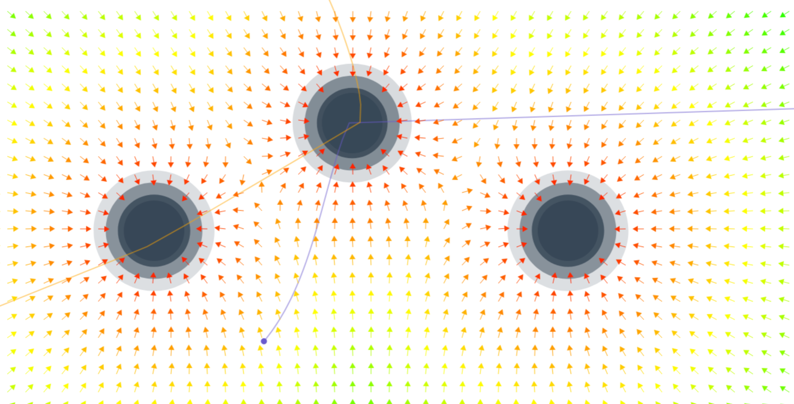

# Planet

## gh-page simulating gravitational field
## A gravitational field simulation website

- This is a website simulating the gravitational field and its effects.
- The website provides a visual view of the gravitational force vectors around the planets.
- The website is interactive, you can play around with moving the 2 planets, and adding particles.
- You can provide partices with an initial velocity.
- It describes the path the particle is going to approach.

> You can view the live website here

- [Planet: gravitational simulation (latest)](https://deploy-preview-9--tsarprince-planets.netlify.app/)
- [Planet: gravitational simulation (original)](https://tsarprince.github.io/Planet/)

---

## **Controls and Features**

- `click` - to create a new particle
- `Shift + click` - to create a new attracting body
- `Click and drag` (empty space) - to adjust particle's initial speed and direction
- `Click and drag` (empty body) - to displace the attracting body

---

## **Technology used**

- The project is developed from a basic HTML and Vanilla JavaScript for the logic and functionality.

---

## **Viewing the website**

- Either clone or download the repo zip in your local system.
> `git clone https://github.com/iiitl/Planets.git`

- Navigate to the index.html file and open it.

---

